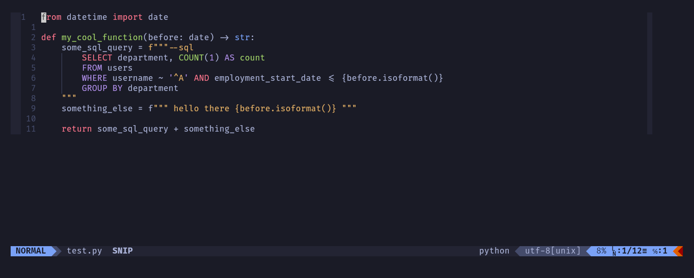

# Vim SQL Strings
Syntax highlight multi-line strings in various languages as SQL if they start with `--sql`

## Install
Install with [vim-plug](junegunn/vim-plug):
```
Plug 'danjones1618/vim_sql_strings'
```
## Demo


## Supported languages
- Python
- C++

